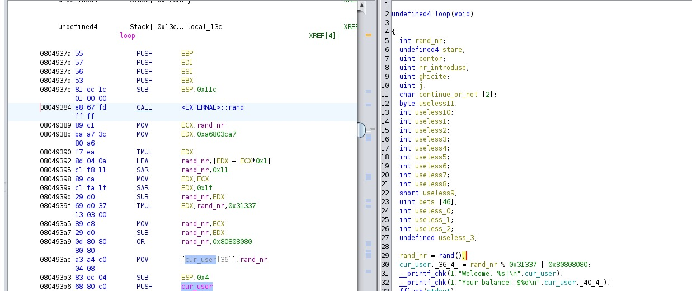

# TSSC Tema 1
### Chiper Alexandra-Diana 342 C4
### 2023-2024

## Task crypto

1. Se face un schimb de chei folosind DH. Se decodeaza mesaje primite cu base64.
2. In al 2-lea mesaj se primesc msg si salt, care trebuie decodate inca o data cu base64.
3. Se calculeaza cheia comuna conform DH si se afla cheie pt aes cu  functia data folosind 
cheia comuna si sarea aflate anterior.
4. Se decripteaza mesajul cu modul ECB de la AES si cheia derivata la pct 3.


## QoL Container Docker
Colorful prompt in container :)

```bash
export PS1="\[\e[32m\][\[\e[m\]\[\e[31m\]\u\[\e[m\]\[\e[33m\]@\[\e[m\]\[\e[32m\]\h\[\e[m\]:\[\e[36m\]\w\[\e[m\]\[\e[32m\]]\[\e[m\]\[\e[32;47m\]\\$\[\e[m\] "
```

## Task ACL
Am creat in `.ssh/config` o intrare noua cu userul si hostul din cheia publica pentru care am specificat IdentityFile ca fiind cheia privata data.

Pentru inceput am cautat cu find dupa *flag* si *hint*.
- cu flag am gasit `/var/local/vim/scripts/jmkr/flag1999`, dar care nu poate fi rwx decat de
catre s4l4m0rx, si aici m-am oprit cu ideea asta
- cu hint am gasit `/var/lib/misc/here/.hints.txt`, care contine 3 hinturi.
    * primul cu Gandalf nu a avut prea mult sens acum
    * al doilea cu find am crezut ca nu mai imi trebuie
    * m-am ocupat de al treilea. 
        - Din cauza formatului cu acele numere in fata, care erau mai mici de 26 m-am gadit la 
        cifrul lui Cezar. Nu am obtinut nimic in mod direct. In final am incercat si cu
        complementul fata de 26 al numerelor date siiiii.... am gasit hintul. 
        - In prima faza nici acest hint nu m-a ajutat prea mult

Cum hinturile nu m-au ajutat prea mult am inceput sa caut prin calea catre
flag cu `cd ..` si `ll`. Am gasit ceva dubios la nivelul /var/local/ unde 
erau 2 directoare: ***trap*** si ***scripts***. Am intrat in trap si am 
gasit un alt director ***manele***. In el era un fisier text mascat ca 
*mp3* cu ceva text. Nu m-a ajutat atat de mult, dar stiind afinitatea pentru 
manele a echipei + cuvantul _trap_ am cautat cu `find` dupa *manele*. 
Coincidenta sau nu, am gasit **/usr/games/hunt/manele** care are un script 
cu suid si owner s4l4m0rx. Am dat lovitura.

~~Ignoram faptul ca puteam sa dau `find / -type f -perm /4000 2>/dev/null` si facea find treaba 
pentru mine sa caute fisierele cu SUID enabled~~

1. La rulare se afiseaza `You shall not pass` => e legat de hintul cu gandalf
2. daca il analizam cu `strings`  => are un string mai ciudat imediat dupa 2 texte cu care pare sa
faca un if strcmp
3. rulam executabilul cu stringul ciudat ca argument => binarul face file + calea la flag1999

Deci daca ne luam dupa al treilea hint, vom modifica variabila PATH astfel incat comanda file sa 
faca ce vrem 
1. facem un executabil nou in /tmp/file care sa citeasca continutul (cat) din flag1999
2. ii dam drepturi de executie
3. adaugam /tmp la inceputul variabilei `$PATH` ca sa gaseasca si execute codul nostru mai intai, 
si nu pe cel din `/bin/find`
4. rulam din nou executabilul cu parametrul gasit .... GATAAAAAA! Avem flagul


## Task Binary-Exploit
Am bagat binarul in Ghidra si am redenumit variabilele din loop corespunzator (useless_1, useless_2, etc :D) 
ca sa fie mai usor de citit



Am scris un pragram in python + pwntools.

- Primul buffer overflow a fost pentru a ajunge in functia ``win``. Am observat ca in functia loop 
se citesc intr-un buffer numerele, dar nu se face bound checking => **_BUFFER OVERFLOW_**

- Am construit payloadul cu 57 (valoare gasita empiric, am inceput de la 46+2 = buffer + suprascrieri) de numere dupa care am pus adresa functiei `win` ca int, pe care am 
obtinut-o din gdb cu comanda:

```bash
(pwngdb) p/d &win
```
- Pentru a citi continutul flag-ului trebuie sa dam si argumentul corect. Observam ca argumentul se 
afla la pozitia 36 din ceea ce pare o structura pentru user. 

- Mai observam si ca in aceeasi structura, incepand cu pozitia [0] se citeste si numele, care este 
mai apoi printat cu `printf` => al 2-lea **_BUFFER OVERFLOW_** pentru a suprascrie terminatorul de 
sir care desparte numele de `lucky number`. Am introdus un nume de exact 36 de caractere.

Am parsat apoi bytearray-ul (raspunsul) primit de la server (cel cu Welcome) si am extras numarul, 
pe care l-am transformat din hex in int. 

Am refacut payloadul astfel: 
```
payload = [numere * 57] + [adresa win] + [numere * 1] + [argument win]
```


