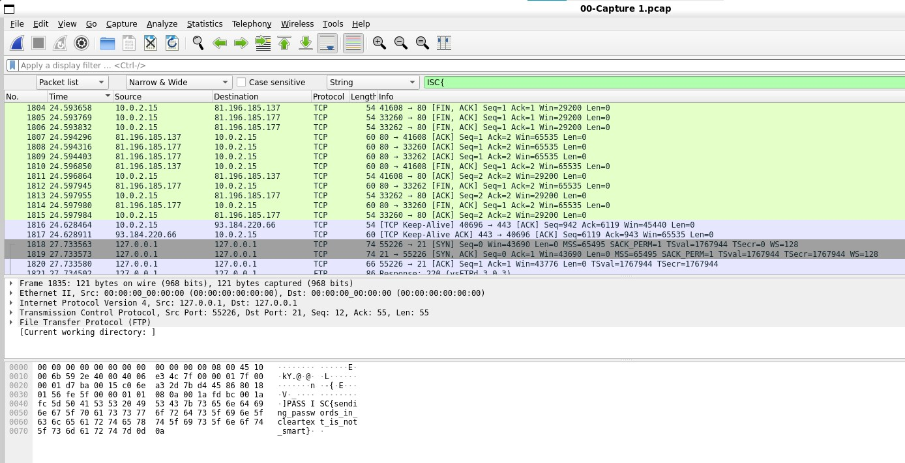
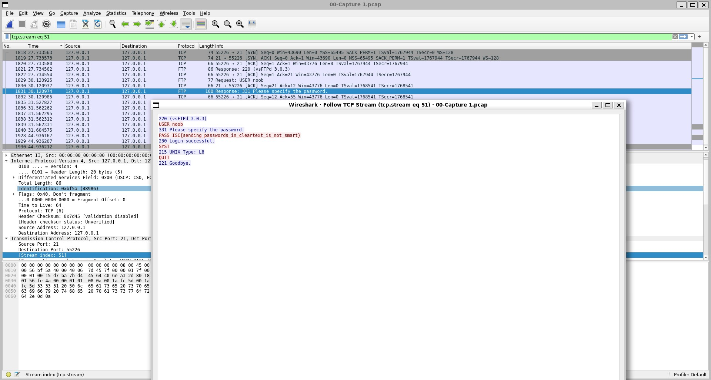
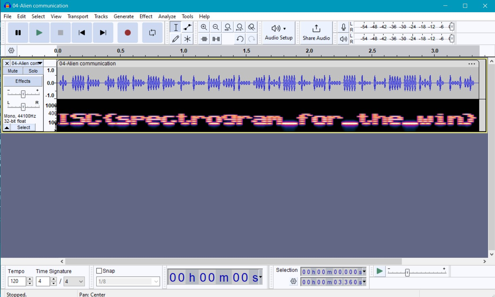
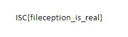

# Lab 10 - Forensics

## Task 00 - Capture 1
Flag: ISC{sending_passwords_in_cleartext_is_not_smart}

### Ver1
1. `Ctrl + F` 
2. Modifica Display filter in String si cauta dupa keyword `ISC`
3. Citeste flagul


### Ver 2
1. Filtram dupa trafic tcp
2. Vedem niste pachete de la sursa 127.0.0.1 
3. Click dreapta pe un pacjet -> Follow -> TCP
4. Vedem toata conversatia in clar



## Task 01 - Unknown File Type

flag: ISC{file_is_our_friend}

Cercetam acest fisier necunoscut cu `file`
```bash
file 01-File
```

Ne zice ca e de tipul gzip => lipseste extensia

Ii adaugam extensia (cu `mv`), decompress ('gzip -d') si citim 
flagul (`cat`).

## Task 02 - Hidden Flag
flag: ISC{we_all_love_grep}

(Ne luam dupa hint-ul gresit pentru ca ma uitam la urmatorul exercitiu :joy:) si inspectam imaginea cu `hexdump -C`
La sfarsit de tot vedem si flagul aruncat pe acolo


## Task 03 - Corrupted file

flag: ISC{no_more_ideas_for_flags}

Ne luam dupa hint si cautam cum trebuie sa arate headerul pt fisiere 
JPG. Vedem ca primii 2 octeti sunt scrisi gresit. Ii corectam cu `hexedit` si deschidem imaginea.


## Task 04 - Audio Visualization

Ne luam dupa hint si instalam Audacity (in Windows ca in WSL nu a vrut de nicio culoare sa mearga)

De langa numele trackului selectam multiview nu doar wave

That's it. You can SEE it now. La propriu.



## Task 5 - Hidden file

Cu binwalk vedem ca in fisierul jpg mai ete ascunsa si o arhiza 7-zip.
binwalk -e nu a mers

am folosit urmatoarea comanda (generata de ChatGPT ofc)

```bash
dd if=05-Idea.jpg bs=1 skip=33519 of=hidden.7z
```

Apoi, din Windows, am deschis arhiva si imaginea din ea



## Task 6 - Censored

flag: ISC{hidden_in_the_dark}

Am deschis pdf cu ABBY FineReader  si pur si simplu am facut drag la
dreptunghiul negru de peste flag. Oricum e vazut ca un commentariu 
(lasat de filip :joy:), deci merge si din alt soft de editat pdf-uri 
(gen Adobe - verificat) si doar stergi comentariul.

## Task 7 - Waiting for eternity

flag: ISC{what_were_you_waiting_for}

Din moment ce gif-ul nu se deruleaza, folosim un utilitar ca sa il 
derulam frame by frame.

```bash
 gifview 07-Dumb.gif
```

Al doilea frame e un qr. Il citim cu telefonul.

## Task 8 - Capture 2

flag: ISC{keycap}

Am gasit site-ul asta care face exact ce trebuie, si cu toate resursele [site](https://blog.stayontarget.org/2019/03/decoding-mixed-case-usb-keystrokes-from.html)


